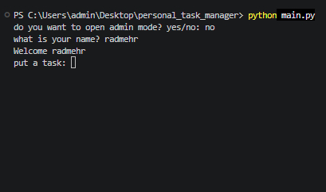
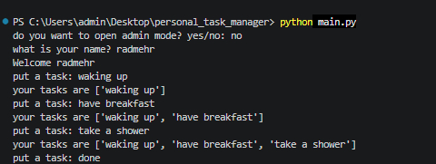
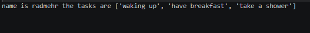

# Personal Task Manager


A simple Python task manager that you could put your tasks in it.

## Table of Contents

* [Features](#features)
* [Project Structure](#project-structure)
* [Requirements](#requirements)
* [Installation](#installation)
* [Environment Setup](#environment-setup)
* [Usage](#usage)
* [Example Output](#example-output)
* [Screenshot](#screenshot)
* [Demo](#demo)
* [Roadmap](#roadmap)
* [Contributing](#contributing)
* [License](#license)
* [Author](#author)

## Features

* Task Management System

  * Adds new tasks
  * Lists existing tasks
  * Removes tasks

* Results Storage

  * Saves task data in a file

* Admin Mode

  * Asks for the admin password
  * Checks if the password is secret-secret-046fea4c
  * Keeps private information outside the main Python file
  * Loads the password from `.env`

## Project Structure

```text
personal_task_manager/

│   .env.example
│   .gitignore
│   main.py
│   tasks.py
│   README.md
│   requirements.txt
│
├───gifs
│       task_demo.gif
│
├───pictures
│       screenshot_1.png
│       screenshot_2.png
│       screenshot_3.png
```

### File Description

| File                        | Description                                             |
| --------------------------- | ------------------------------------------------------- |
| `main.py`                   | Main file used to run the task manager                  |
| `tasks.py`                  | Stores task data and logic                              |
| `requirements.txt`          | Lists the Python packages needed for the project        |
| `.env.example`              | Shows the environment variables needed by the project   |
| `.gitignore`                | Tells Git which files and folders should not be tracked |
| `README.md`                 | Contains the project documentation                      |
| `pictures/`                 | Stores project screenshots                              |
| `pictures/screenshot_1.png` | Screenshot of the game start                            |
| `pictures/screenshot_2.png` | Screenshot of the quiz section                          |
| `pictures/screenshot_3.png` | Screenshot of the final result                          |
| `gifs/`                     | Stores project demo GIFs                                |
| `gifs/task_demo.gif`        | Shows the project demo                                  |

## Requirements

Before running the project, make sure you have:

* `Python 3`
* `python-dotenv`

## Installation

1. Open a terminal in the project folder.

2. Check that Python is installed:

```bash
python --version
```

3. Install the Python packages:

```bash
pip install -r requirements.txt
```

## Environment Setup

1. Create a `.env` file from `.env.example`:

```bash
cp .env.example .env
```

2. Open the new `.env` file.

3. Replace the example value with your own password:

```text
ADMIN_PASSWORD=your_secret_key_here
```

4. Save the file.

> Do not commit your `.env` file because it may contain private information.

## Usage

1. Open a terminal in the project folder.

2. Run the task manager:

```bash
python main.py
```

3. Choose `yes` or `no` for admin mode.

4. If you choose `yes`, enter the password from your `.env` file.

5. Manage your tasks.

## Example Output

```text
Do you want to open admin mode? yes/no: no

Enter your task: Buy groceries

Task added!
```

## Screenshot

### Start



### Tasks



### Final



## Demo


## Roadmap

* [x] Add tasks
* [x] List tasks
* [x] Save tasks
* [x] Add admin mode
* [ ] Add delete function
* [ ] Add edit function
* [ ] Add priority

## Contributing

## License

## Author

Created by [Radmehr Alizadeh](https://github.com/radmehr08)